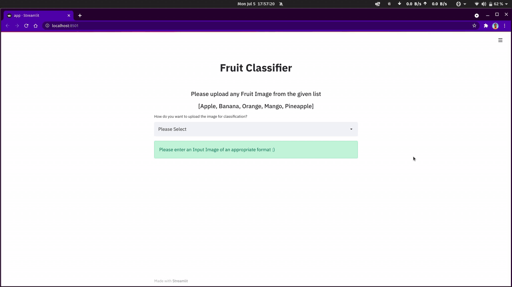

<h1 align="center"> Fruit Classifier </h1>

This project helps to classify different types of fruits using Convolutional Neural Networks (CNNs). It is a neural network that has one or more convolutional layers. It is mainly used for image processing, classification, segmentation, and also for other correlated data. CNNs are used for their high accuracy.

----
<h2> Dataset </h2>
The dataset is made from scratch. It is divided into two categories namely test and train. Each of those categories is divided into five classes.

1. Apple
2. Banana
3. Mango
4. Orange
5. Pineapple

----
<h2> How to use the project </h2>

1. Installing the required softwares:-
    ```bash
    pip install -r requirements.txt
    ```
2. Cloning the repository:- 
    ```bash
    git clone https://github.com/archihalder/Fruit-Classifier.git
    ```
3. Change the directory:-
    ```bash
    cd Fruit-Classifier
    ```
4. Run the web app:-
    ```bash
    streamlit run app.py
    ```
5. To close the app from the terminal, press Ctrl+C.

----
<h2> Demo </h2>


